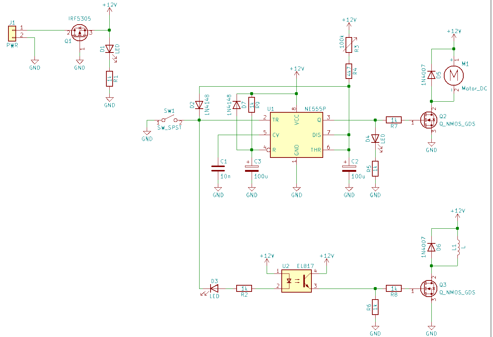
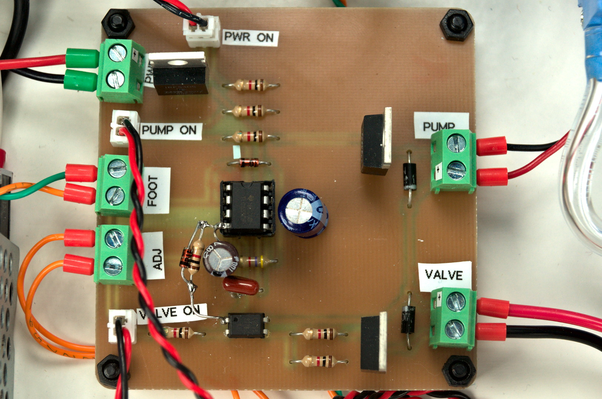
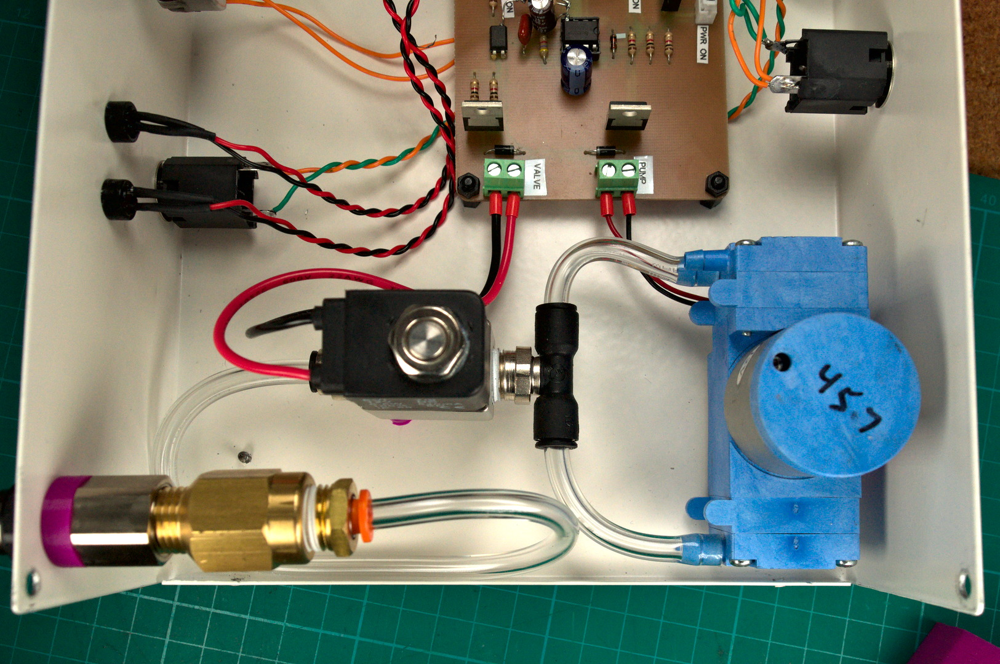

# Manual Pick and Place SMD Vacuum

*Copy from blog post: https://samueldperry.com/2021/06/07/manual-pick-and-place-smd-vacuum/*

Until recently I used tweezers when populating surface mount parts on a PCB. Browsing around on YouTube late one night I stumbled upon a video by [SDG Electronics](https://www.youtube.com/channel/UCMiC9bSMux7i2Ds6sIqDaFg) about making a [Manual Pick and Place SMD Vacuum](https://www.youtube.com/watch?v=9G510G2gmdo&t=24s). There is also a [part 2](https://www.youtube.com/watch?v=1FnGqH_WkL4&list=RDCMUCMiC9bSMux7i2Ds6sIqDaFg&index=3) for those interested. I was then motivated to make up my own since it looked so much easier then using tweezers. There was no parts list from SDG Electronics that I could find so I set about searching for suitable components and designing my own simple controller PCB. Below is a description of the mechanical and electrical designing of the SMD Vacuum that I ended up building.

## Bill Of Materials

Below is a bill of materials with supplier links of all the major mechanical and electrical components. The PCB controller components are presented in a separate BOM below without suggested supplier links since all the components are generic and can be sourced from the usual suspects.
No. |Item|	Qty.|	Suggested Supplier Link
-----|----|-----|--------------------------|
1|	Metal Enclosure, 7.5″ x 9.8″ x 3.2″|	1|	[Jameco](https://www.jameco.com/webapp/wcs/stores/servlet/ProductDisplay?langId=-1&storeId=10001&catalogId=10001&productId=209358)
2|	LED Panel Mounting Hardware|	10|	[Jameco](https://www.jameco.com/webapp/wcs/stores/servlet/ProductDisplay?langId=-1&storeId=10001&catalogId=10001&productId=23077)
3|	12V Diaphragm Vacuum Pump|	1|	[eBay](https://www.ebay.com/itm/221615572829?epid=1545518177&hash=item339951475d:g:GFgAAOSwhMFZqyRF)**
4|	12V Pneumatic Shutoff Valve|	1|	[eBay](https://www.ebay.com/itm/114832826636?hash=item1abc91e10c:g:bG0AAOSwbg9gtVNb)
5|	1/4″ NPT Inline Filter/Snubber|	1|	[eBay](https://www.ebay.com/itm/132229655610)
6|	Vacuum Pick & Place Tool|	1|	[DigiKey](https://www.digikey.com/en/products/detail/apex-tool-group/T0052918499N/1801476?s=N4IgTCBcDaICoAYEFYwE4CMAOALGtAciALoC%2BQA)
7|	1/4″ PVC Tubing|	50ft|	[McMaster-Carr](https://www.mcmaster.com/5233K52/)
8|	1/4″ Tube Fitting, Through Wall|	1|	[McMaster-Carr](https://www.mcmaster.com/5779K272/)
9|	1/4″ Tube Fitting to 1/4″ NPT Male|	3|	[McMaster-Carr](https://www.mcmaster.com/7880T125/)
10|	12V 1.3A AC to DC Power Supply|	1|	[Jameco](https://www.jameco.com/webapp/wcs/stores/servlet/ProductDisplay?langId=-1&storeId=10001&catalogId=10001&productId=1919051)
11|	1/4″ Phone Jack|	2|	[Jameco](https://www.jameco.com/webapp/wcs/stores/servlet/ProductDisplay?langId=-1&storeId=10001&catalogId=10001&productId=297537)
12|	IEC 320-C14 Power Entry Module with Fuse|	1|	[Amazon](https://www.amazon.com/Module-Socket-Connector-Blades-Holder/dp/B07TQMW2D9/ref=sr_1_1?crid=3QOD60WNOGIO3&dchild=1&keywords=power+entry+module+with+fuse&qid=1622939893&sprefix=power+entry+mo%2Caps%2C180&sr=8-1)*
13|	Rocker Switch|	1|	[Amazon](https://www.amazon.com/QTEATAK-Rocker-Switch-Position-Terminals/dp/B08B84H8WL/ref=sr_1_5?crid=1LWHY6BQHJB3N&dchild=1&keywords=rocker+switch&qid=1622940058&sprefix=rocker+%2Caps%2C186&sr=8-5)*
14|	3mm LED, Red/Green|	3|	[Amazon](https://www.amazon.com/Chanzon-100pcs-colors-Emitting-Assorted/dp/B01AUI4W5U/ref=sr_1_3?dchild=1&keywords=3mm+led&qid=1622940238&sr=8-3)*
15|	100k Potentiometer with Knob|	1|	[Amazon](https://www.amazon.com/TWTADE-rv24yn20s-Variable-Potentiometer-Regulation/dp/B07DHFYLRV/ref=sr_1_6?crid=1AW49CSX56C4B&dchild=1&keywords=100k+potentiometer&qid=1622940371&sprefix=100k+po%2Caps%2C186&sr=8-6)*
16|	Foot Switch with 1/4″ Plug|	1|	[eBay](https://www.ebay.com/itm/272420357567)
17|	Various Fasteners and Similar Hardware|		
18|	Assembled Controller|	1|	See BOM Below

*I didn’t buy these exact items since I had them already from previous projects but these should be equivalent to what I used. Substitutions are possible for items you have on hand.

**When I was looking for a small vacuum pump eBay was flooded with the Parker 12V Dual Head Vacuum Pump which is what I got. But now it seems to be out of stock and since it looks like it was a surplus item it is probably out of stock for good. The linked vacuum pump looks like it will work just as well but I have not tested it.

No.|	Item|	Qty.
---|--------|-------
1|	PCB|	1
2|	10nF Ceramic Capacitor|	1
3|	100uF 25V Electrolytic Capacitor|	2
4|	1N4148 Diode|	2
5|	1N4007 Diode|	2
6|	IRF5305 P-channel MOSFET|	1
7|	N-channel MOSFET|	2
8|	4.7k 1/4W Through Hole Resistor|	1
9|	1k 1/4W Through Hole Resistor|	7
10|	NE555P 555 Timer|	1
11|	817 Optocoupler|	1
12|	8 pin DIP IC Socket|	1
13|	2 Position Screw Terminal|	5
14|	JST Socket with Matching Connectors and Pins|	2

## Controller PCB

Yes this project uses a 555 timer, as a electronics hobbyist I am contractually obligated to use it in at least one project. While the solution by SDG Electronics with a microcontroller is perfectly valid and what I would have normally used, I decided to finally use a 555 timer in a project. I hate the 555 timer and find it completely unnecessary in today’s microcontroller dominated world. Why use a IC that requires external components when a few lines of code and less components will produce the same result with more accurate timings? I have to admit that at the end of this project I had a little respect for the 555 timer and found it a good challenge to try to manipulate it to do what I wanted. I may briefly consider it in future simple projects.

The PCB is designed to enable milling on a CNC router such as the 3018 Pro and that is what I did. [Gerbers](https://github.com/sdp8483/smd_vacuum/tree/main/pcb/gerber) are available but be warned I did not pay any attention to the silkscreen so some component labels could be in strange spots or missing. If you want to get your PCBs made I would suggest opening the KiCAD design files and fixing the silkscreen labels before.

The circuit is fairly simple, closing SW1 (the foot switch) turns on the vacuum pump and opens the shutoff valve. LED D2 and D3 will be illuminated. Releasing SW1 will close the shutoff valve turning off suction upstream of the shutoff valve and LED D3 will turn off. The vacuum pump will continue to run based on the position of the 100k potentiometer, somewhere between 1 and 15 seconds.

PCB assembly is easy when following the [interactive bom](https://github.com/sdp8483/smd_vacuum/tree/main/pcb/bom). In the pictures you may notice mine has a bodge since my first design neglected the reset on power circuitry and I had to add that after I noticed that sometimes on first power up the controller would turn on the vacuum pump. The PCB design has been updated with those components so no need for you to bodge them in.

## Assembly

I will go over briefly how I assembled my SMD Vacuum but will omit many details since you most likely will not be using the same vacuum pump and you may wish your layout to be slightly different.

First thing I did was to arrange all the components inside the enclosure so that I could see if everything would fit. I roughly knew that I wanted to keep the power supply and its AC wiring on the left of the case, with the controller in the middle and the pneumatics on the right side of the case. I also arranged the front and back panels to look like I wanted. Pencil works great since it can easily be cleaned off later.

I started with mounting the AC power input socket, rocker switch, and 12V power supply. I wired the rocker switch to cut power to the input of the 12V power supply so that when the unit is turned off there will be zero current draw. Don’t forget to attach the earth ground from the AC socket to the case using a bolt and star washer. Sand off some of the paint under the washer on the case to make a good metal to metal connection. Also attach the earth ground of the 12V power supply to this same point. This way the case is grounded and is safer.

I then mounted the controller PCB using nylon standoffs near the center of the case and oriented it so that the power input terminal is close to the 12V power supply. At the same time I mounted the 100k potentiometer, LEDs, and 1/4″ jacks. I used two 1/4″ jacks in parallel because I wanted both the front and back panels to have a jack. This way I can plug the foot switch into whatever panel is most convenient for wire management.

For the pnumatics I 3D printed some standoffs so that they would not be resting directly on the case. This was mostly done because of the length of fasteners I had and also to dampen the noise produced by the vacuum pump. I plumbed the punmatics as shown below with the shutoff valve between the pump and the filter followed by the panel mounted 1/4″ tube fitting. The filter is absolutely necessary as I have already sucked up quite a few 0603 parts and having the filter saves the shutoff valve and pump from damage.

That was about all the steps I took for assembly, fairly simple. The aluminum bars in the pictures were added to increase the stiffness of the front and back panel when plugging in connectors and tubing.

## Hand piece

Aside from the vacuum pump the second most important item for this build is the hand piece. This is the part that you hold and use to pickup SMD parts. I was able to find a used Weller WVP on eBay. I would suggest looking there or other used market places first since it is relatively expensive brand new for some reason. The part number to search for is T0052918499N or look for replacement parts for a Weller WR3M Station. [DigiKey](https://github.com/sdp8483/smd_vacuum/tree/main/pcb/bom) sells a new Weller WVP for $88. The Weller WVP is adapted to the SMD Vacuum by cutting a small section of the 1/4″ PVC tubing and inserting the plastic nozzle on the end hand piece into the tubing as shown below. Finally block the hole on the side of the Weller WVP since we are using to foot pedal to control suction and not your finger.

This hand piece feels really nice and works well for me. Having said that if you cannot find one for a decent price or feel like making your own hand piece I did do a little experimentation and found that it is possible to make something similar while not as well polished. I used a [1/8″ OD Brass Tube](https://www.mcmaster.com/8859K19/) and connected it to the front port of the SMD Vacuum using [1/4″ OD Soft Tygon PVC Tubing](https://www.mcmaster.com/5552k23/). The clear PVC tubing used inside the SMD Vacuum is a little stiff for my liking and I found that Tygon tubing is slightly more pliant. The photos below show the rough setup I was experimenting with before I found the Weller Hand Piece. My plan was to 3D print a case to go around the brass tube for gripping and to also 3D print adapters so that the nozzles could connect better to the brass tube. As pictured it works fine although not very ergonomic. For nozzles I used a rubber protective cover that comes on the engraving bits for the 3018 pro with a small hole that I drilled in the end. This setup was a rough prototype that I would have refined more had I not picked up a Weller WVP.

## Nozzles

Nozzles, you will need some. The Weller WVP comes with some nozzles and suction cup tips. You can also get these nozzle and cups with one of the cheap [vacuum suction pens](https://www.amazon.com/Jiayouy-Precision-Component-Placement-Interchangeable/dp/B08SWG12G3/ref=sr_1_3?dchild=1&keywords=smd+pen&qid=1623079740&sr=8-3). These nozzles and suction cups are great for picking up larger SMD packages like microcontrollers and power MOSFETs but they are not useful for small packages such as 0603 resistors and capacitors. The suction cup gets in the way and grips the part so well that it will not release when suction is turned off. Removing the suction cup is not possible since the nozzle ID is large enough that a 0603 resistor can get sucked up it. Remember that filter, this is why it is installed before the shutoff valve.

What I found that works great for these small packages is [blunt tip needles for syringes](https://www.amazon.com/dp/B07RSTQ6RV?psc=1&ref=ppx_yo2_dt_b_product_details). I got a variety pack with 14ga, 16ga,18ga, 20ga, 22ga and 25ga needles along with some syringes. I found the 20ga needle (pink) to be the perfect size for picking up 0603 packages along with SOT-23 transistors and some larger packages. The part drops off as soon a suction is off and you can see the part while manipulating it. The only problem is that the nozzle requires you to work with the hand piece vertical since it does not have the angle on it like the nozzles that came with the Weller WVP. If I get adventurous I may try bending one someday but for now I found working vertical gave me better position control.

## Conclusion

That wraps up this project. I am very happy with how it turned out and its function. I successfully assembled a small run of 10 PCBs with 64 components per board using this SMD Vacuum without any issues. Utilizing the blunt needle tip along with one of the suction cup tips that came with the Weller WVP I was able to handle all the SMD parts for those PCBs. The smallest package size was 0603 and the largest package was a ESP-12F WiFi module. The SMD Vacuum had enough suction power to lift everything and made placement easy. Goodby tweezers, hello SMD Vacuum.
